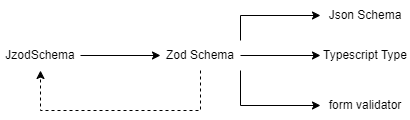
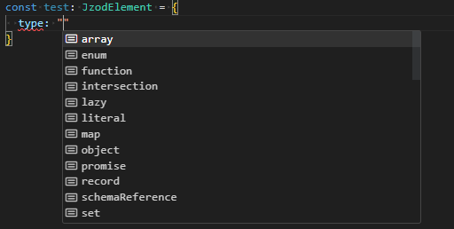

# Jzod

Provides a straightforward JSON interface to [Zod](https://github.com/colinhacks/zod) schema.

## Installation

```sh
npm install @miroir-framework/jzod
```

## Principle

Instead of writing [Zod](https://github.com/colinhacks/zod) schemas:

```js
import { z } from "zod";

const myZodSchema = z.object({a:z.number().optional(), b: z.array(z.string())})
```

One may write, to get the equivalent result:

```js
import { jzodToZod } from "@miroir-framework/jzod";

const myJzodSchema = {
  type: "object",
  definition: { 
    a: { type: "simpleType", definition: "number", optional: true },
    b: { type:"array", definition: { type:"simpleType", definition:"boolean" } }
  }
}
const myZodSchema = jzodToZod(myJzodSchema);
```

Which requires to type more characters, but provides a plain JSON structure that can be serialized, transformed, and reused. Transparency is furthermore gained, as two Jzod schemas can be easily compared with each other, which is not the case of Zod Schemas.

## Usage



Using the features of Zod, one may obtain, in a single movement:

- a form validator, usable in any webapp,
- Typescript types, for the Typescript-inclined, (try it, maybe!)
- a JSON schema, standardized way of describing data structures,
- plenty of other things, see [Zod Ecosystem](https://zod.dev/?id=zod-to-x)

Jzod provides a description of the format of Jzod schemas, a converter to Zod schemas, and a converter from Zod Schemas to Jzod Schemas. The schema describing the format of Jzod Schemas is itself a Jzod Schema (bootstrap).

Jzod depends on [zod-to-ts](https://www.npmjs.com/package/zod-to-ts) for direct Typescript type generation from Jzod Schemas, and also provides a Zod schema code generator.

Here are some examples:

```ts
const union: JzodElement = {
  type: "union",
  definition: [
    {
      type: "object",
      definition: { a: { type: "simpleType", definition: "string" } },
      , validations:[{ type: "min", parameter: 5 }, { type:"includes", parameter:"#"}] // string must be at least 5 characters long and contain '#'
    },
    {
      type: "object",
      definition: { b: { type: "simpleType", definition: "number" } },
    },
  ],
};
```

## Features

All "primitive" Zod types are supported (`number`, `string`, `date`, see [Zod Primitives](https://zod.dev/?id=primitives)), data structures (`literal`, `enum`, `object`, `union`, `array`, `tuple`, `record`, etc.), and  validations (`min`, `max`,).

Jzod allows defining and referencing Jzod schemas within Jzod Schemas, which fosters type reuse, enables direct definition of recursive types, and allows one to avoid relying on js-level constant definition / referencing for such purposes, that can be quite cumbersome.

For details about the (yet) unsupported, see [Limitations and Drawbacks](limitations-and-Drawbacks).

### Typescipt Use

Jzod provides Typescript Types for Jzod Schemas. One thus benefits from completion when typing, at least on modern IDEs:



### Conversion to Zod

### Conversion From Zod

### Conversion to Typescript

### Bootstrap

## Advantages compared to plain Zod schemas

### Extensibility

### Support for Generic / Parametered Types

### Flexible Interpretation

## Limitations and Drawbacks

Jzod does not currently check for adequate use of validation contraints parameters with the employed Zod schema type; for example, it is allowed to pass a parameter to the number `int` constraint, which does not make sense. The
type of the parameter is not checked, either. Finally, Jzod does not allow to pass a custom error message (second parameter) to validators (TBD).

Native enums are not supported yet.

